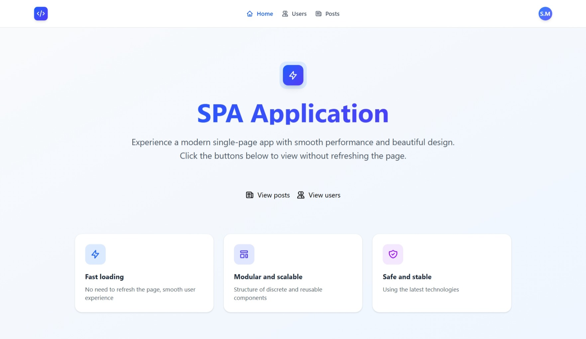
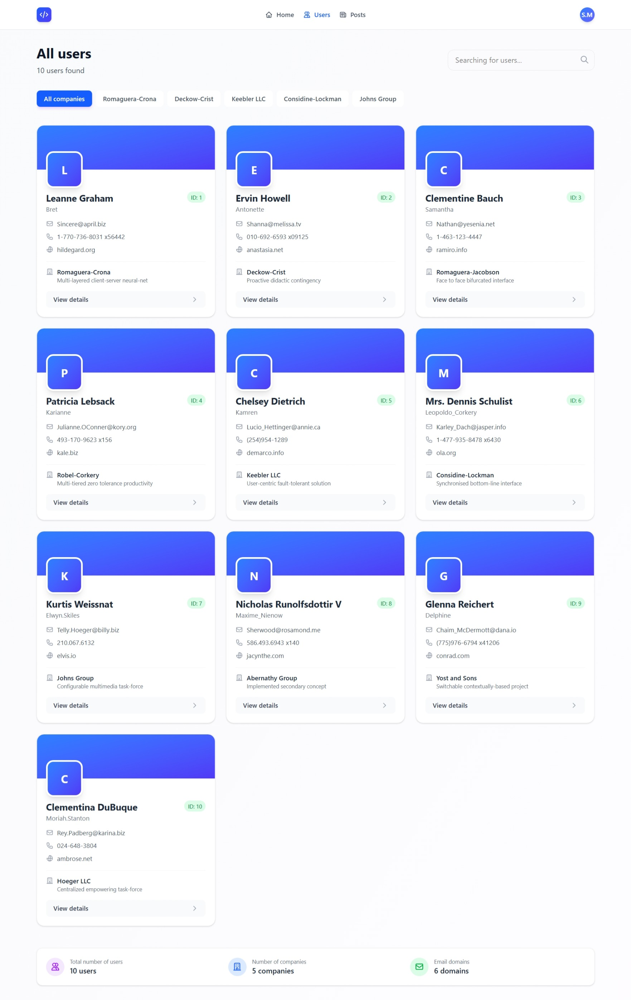
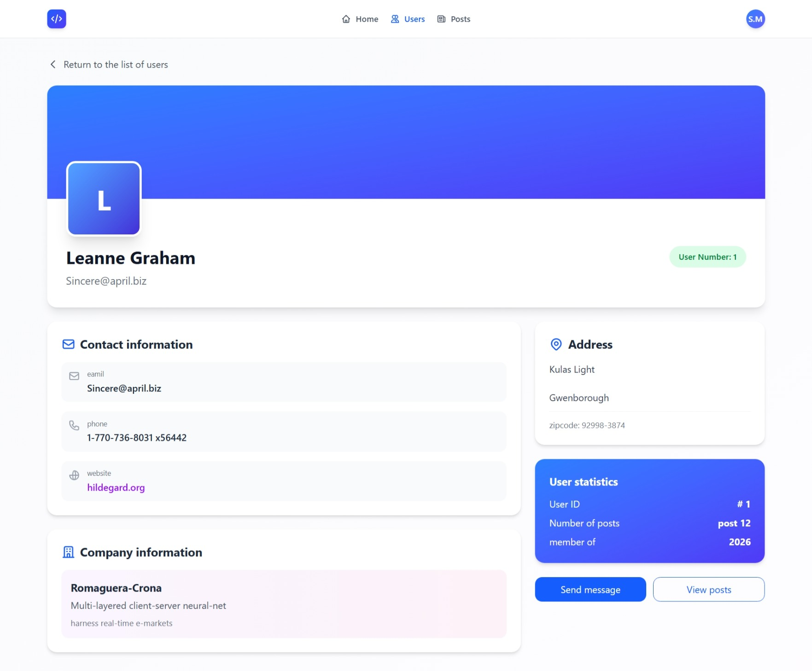

### 🚀 SPA Application

سلام! به پروژه Single Page Application (SPA) با React خوش آمدید. این پروژه یک اپلیکیشن تک صفحه‌ای کامل است که با استفاده از React و Tailwind CSS ساخته شده و از JSONPlaceholder API برای دریافت داده‌های واقعی استفاده می‌کند.

---

### 📚 معرفی

**SPA Application** PA React یک اپلیکیشن تک صفحه‌ای (Single Page Application) مدرن و کامل است که با هدف نمایش توانمندی‌های React در ساخت برنامه‌های وب پویا و سریع طراحی شده است. این پروژه یک نمونه کار عملی برای توسعه‌دهندگان مبتدی و متوسط محسوب می‌شود که به دنبال درک بهتر مفاهیم کلیدی React در یک پروژه واقعی هستند.

---

### 🖥️ پیش‌نمایش





---

### 🔧 تکنولوژی‌های استفاده شده

- HTML5
- CSS3
- React - کتابخانه اصلی برای ساخت UI
- React Router DOM - برای مدیریت مسیرها
- Tailwind CSS - برای استایل‌دهی سریع و مدرن
- Vite - برای ساخت و توسعه سریع
- JSONPlaceholder API - برای داده‌های ساختگی

---

### 🖥️ نمونه کد

```js
{
  import { useEffect, useState } from "react";
  import { Link } from "react-router";

  function Home() {
    const [loading, setLoading] = useState(true);

    useEffect(() => {
      const timer = setTimeout(() => {
        setLoading(false);
      }, 800);

      return () => clearTimeout(timer);
    }, []);

    return (
      <>
        {loading && (
          <div className="fixed inset-0 bg-white/90 backdrop-blur-sm z-50 flex justify-center items-center">
            <div className="text-center">
              <div className="relative inline-block">
                <div className="w-24 h-24 bg-gradient-to-br from-blue-600 to-indigo-600 rounded-2xl flex items-center justify-center shadow-2xl animate-pulse">
                  <svg
                    className="w-12 h-12 text-white"
                    fill="none"
                    stroke="currentColor"
                    viewBox="0 0 24 24"
                  >
                    <path
                      strokeLinecap="round"
                      strokeLinejoin="round"
                      strokeWidth={2}
                      d="M13 10V3L4 14h7v7l9-11h-7z"
                    />
                  </svg>
                </div>
                <div className="absolute -top-2 -right-2">
                  <div className="w-6 h-6 border-2 border-blue-600 border-t-transparent rounded-full animate-spin"></div>
                </div>
              </div>
              <h3 className="mt-6 text-xl font-semibold text-gray-800">
                Loading{" "}
              </h3>
              <p className="mt-2 text-gray-500">Please wait...</p>
            </div>
          </div>
        )}
        <div className="min-h-screen bg-gradient-to-br from-slate-50 to-blue-50">
          <div className="container mx-auto px-4 sm:px-6 lg:px-8 pt-20 pb-16">
            <div className="text-center max-w-3xl mx-auto mb-16">
              <div className="inline-flex items-center justify-center p-2 bg-blue-100 rounded-2xl mb-6">
                <div className="w-12 h-12 bg-gradient-to-br from-blue-600 to-indigo-600 rounded-xl flex items-center justify-center shadow-lg">
                  <svg
                    className="w-6 h-6 text-white"
                    fill="none"
                    stroke="currentColor"
                    viewBox="0 0 24 24"
                  >
                    <path
                      strokeLinecap="round"
                      strokeLinejoin="round"
                      strokeWidth={2}
                      d="M13 10V3L4 14h7v7l9-11h-7z"
                    />
                  </svg>
                </div>
              </div>

              <h1 className="text-4xl sm:text-5xl lg:text-6xl font-bold bg-gradient-to-r from-blue-600 to-indigo-600 bg-clip-text text-transparent mb-6">
                SPA Application
              </h1>

              <p className="text-lg sm:text-xl text-gray-600 leading-relaxed">
                Experience a modern single-page app with smooth performance and
                beautiful design. Click the buttons below to view without
                refreshing the page.
              </p>
            </div>

            <div className="flex flex-col sm:flex-row justify-center gap-4 mb-20">
              <span className="relative z-10 flex items-center gap-2">
                <svg
                  className="w-5 h-5"
                  fill="none"
                  stroke="currentColor"
                  viewBox="0 0 24 24"
                >
                  <path
                    strokeLinecap="round"
                    strokeLinejoin="round"
                    strokeWidth={2}
                    d="M19 20H5a2 2 0 01-2-2V6a2 2 0 012-2h10a2 2 0 012 2v1m2 13a2 2 0 01-2-2V7m2 13a2 2 0 002-2V9a2 2 0 00-2-2h-2m-4-3H9M7 16h6M7 8h6v4H7V8z"
                  />
                </svg>
                View posts
              </span>
              <div className="absolute inset-0 bg-gradient-to-r from-indigo-600 to-blue-600 opacity-0 group-hover:opacity-100 transition-opacity duration-200"></div>

              <Link to="/posts" className="flex items-center gap-2">
                <svg
                  className="w-5 h-5"
                  fill="none"
                  stroke="currentColor"
                  viewBox="0 0 24 24"
                >
                  <path
                    strokeLinecap="round"
                    strokeLinejoin="round"
                    strokeWidth={2}
                    d="M12 4.354a4 4 0 110 5.292M15 21H3v-1a6 6 0 0112 0v1zm0 0h6v-1a6 6 0 00-9-5.197M13 7a4 4 0 11-8 0 4 4 0 018 0z"
                  />
                </svg>
                View users
              </Link>
            </div>

            <div className="grid md:grid-cols-3 gap-6 max-w-5xl mx-auto">
              <div className="bg-white rounded-2xl p-6 shadow-sm hover:shadow-md transition-shadow duration-300">
                <div className="w-12 h-12 bg-blue-100 rounded-xl flex items-center justify-center mb-4">
                  <svg
                    className="w-6 h-6 text-blue-600"
                    fill="none"
                    stroke="currentColor"
                    viewBox="0 0 24 24"
                  >
                    <path
                      strokeLinecap="round"
                      strokeLinejoin="round"
                      strokeWidth={2}
                      d="M13 10V3L4 14h7v7l9-11h-7z"
                    />
                  </svg>
                </div>
                <h3 className="font-bold text-gray-800 mb-2">Fast loading</h3>
                <p className="text-gray-600 text-sm">
                  No need to refresh the page, smooth user experience
                </p>
              </div>

              <div className="bg-white rounded-2xl p-6 shadow-sm hover:shadow-md transition-shadow duration-300">
                <div className="w-12 h-12 bg-indigo-100 rounded-xl flex items-center justify-center mb-4">
                  <svg
                    className="w-6 h-6 text-indigo-600"
                    fill="none"
                    stroke="currentColor"
                    viewBox="0 0 24 24"
                  >
                    <path
                      strokeLinecap="round"
                      strokeLinejoin="round"
                      strokeWidth={2}
                      d="M4 5a1 1 0 011-1h14a1 1 0 011 1v2a1 1 0 01-1 1H5a1 1 0 01-1-1V5zM4 13a1 1 0 011-1h6a1 1 0 011 1v6a1 1 0 01-1 1H5a1 1 0 01-1-1v-6zM16 13a1 1 0 011-1h2a1 1 0 011 1v6a1 1 0 01-1 1h-2a1 1 0 01-1-1v-6z"
                    />
                  </svg>
                </div>
                <h3 className="font-bold text-gray-800 mb-2">
                  Modular and scalable
                </h3>
                <p className="text-gray-600 text-sm">
                  Structure of discrete and reusable components
                </p>
              </div>

              <div className="bg-white rounded-2xl p-6 shadow-sm hover:shadow-md transition-shadow duration-300">
                <div className="w-12 h-12 bg-purple-100 rounded-xl flex items-center justify-center mb-4">
                  <svg
                    className="w-6 h-6 text-purple-600"
                    fill="none"
                    stroke="currentColor"
                    viewBox="0 0 24 24"
                  >
                    <path
                      strokeLinecap="round"
                      strokeLinejoin="round"
                      strokeWidth={2}
                      d="M9 12l2 2 4-4m5.618-4.016A11.955 11.955 0 0112 2.944a11.955 11.955 0 01-8.618 3.04A12.02 12.02 0 003 9c0 5.591 3.824 10.29 9 11.622 5.176-1.332 9-6.03 9-11.622 0-1.042-.133-2.052-.382-3.016z"
                    />
                  </svg>
                </div>
                <h3 className="font-bold text-gray-800 mb-2">
                  Safe and stable
                </h3>
                <p className="text-gray-600 text-sm">
                  Using the latest technologies
                </p>
              </div>
            </div>
          </div>
        </div>
      </>
    );
  }

  export default Home;
}
```

---

### ✨ ویژگی‌ها

- 🎯 **معماری SPA** – تجربه کاربری روان بدون نیاز به رفرش صفحه
- 💡 **طراحی شده با** – رابط کاربری مدرن Tailwind CSS و کاملاً ریسپانسیو
- 🧭 **مدیریت state** – با استفاده از React Hooks (useState, useEffect)
- 📩 **Routing** – با کتابخانه React Router DOM
- 🧠 **دریافت داده** – JSONPlaceholder API برای نمایش پست‌ها و کاربران
- 📱 **کاملاً واکنش‌گرا** – سازگار با موبایل، تبلت و دسکتاپ
- ⚙️ **حالت‌های مختلف** – نمایش لودینگ، خطا و داده‌های خالی
- 😎 **حالت‌های مختلف** – نمایش لودینگ، خطا و داده‌های خالی

---

### 📂 ساختار پوشه‌ها

src/
├── components/
│ ├── Header.jsx # هدر سایت با ناوبری
│ └── Loading.jsx # کامپوننت لودینگ
├── pages/
│ ├── post/
│ │ ├── Index.jsx # لیست پست‌ها
│ │ └── Show.jsx # جزئیات پست
│ └── user/
│ ├── Index.jsx # لیست کاربران
│ └── Show.jsx # جزئیات کاربر
├── App.jsx # کامپوننت اصلی
└── main.jsx # نقطه ورود برنامه
و موارد بیشتر...

---

👤 توسعه‌ دهنده :
محمدرضا جعفری

ساخته شده با ❤️ برای آموزش و الهام‌بخشی به توسعه‌دهندگان آینده.

---

### 🚀 SPA Application

## Hello! Welcome to the Single Page Application (SPA) with React project. This project is a complete single page application built using React and Tailwind CSS and uses the JSONPlaceholder API to get the actual data.

### 📚 Overview

**SPA Application** SPA React is a modern and complete Single Page Application (SPA) designed to showcase React's capabilities in building fast, dynamic web applications. This project is a practical example for beginner and intermediate developers looking to better understand key React concepts in a real-world project.

---

### 🛠️ Built With

- HTML5
- CSS3
- React - The core library for building UI
- React Router DOM - For managing routes
- Tailwind CSS - For fast and modern styling
- Vite - For rapid development
- JSONPlaceholder API - For mock data

---

### 🖥️ Code example

```js
{
  import { useEffect, useState } from "react";
  import { Link } from "react-router";

  function Home() {
    const [loading, setLoading] = useState(true);

    useEffect(() => {
      const timer = setTimeout(() => {
        setLoading(false);
      }, 800);

      return () => clearTimeout(timer);
    }, []);

    return (
      <>
        {loading && (
          <div className="fixed inset-0 bg-white/90 backdrop-blur-sm z-50 flex justify-center items-center">
            <div className="text-center">
              <div className="relative inline-block">
                <div className="w-24 h-24 bg-gradient-to-br from-blue-600 to-indigo-600 rounded-2xl flex items-center justify-center shadow-2xl animate-pulse">
                  <svg
                    className="w-12 h-12 text-white"
                    fill="none"
                    stroke="currentColor"
                    viewBox="0 0 24 24"
                  >
                    <path
                      strokeLinecap="round"
                      strokeLinejoin="round"
                      strokeWidth={2}
                      d="M13 10V3L4 14h7v7l9-11h-7z"
                    />
                  </svg>
                </div>
                <div className="absolute -top-2 -right-2">
                  <div className="w-6 h-6 border-2 border-blue-600 border-t-transparent rounded-full animate-spin"></div>
                </div>
              </div>
              <h3 className="mt-6 text-xl font-semibold text-gray-800">
                Loading{" "}
              </h3>
              <p className="mt-2 text-gray-500">Please wait...</p>
            </div>
          </div>
        )}
        <div className="min-h-screen bg-gradient-to-br from-slate-50 to-blue-50">
          <div className="container mx-auto px-4 sm:px-6 lg:px-8 pt-20 pb-16">
            <div className="text-center max-w-3xl mx-auto mb-16">
              <div className="inline-flex items-center justify-center p-2 bg-blue-100 rounded-2xl mb-6">
                <div className="w-12 h-12 bg-gradient-to-br from-blue-600 to-indigo-600 rounded-xl flex items-center justify-center shadow-lg">
                  <svg
                    className="w-6 h-6 text-white"
                    fill="none"
                    stroke="currentColor"
                    viewBox="0 0 24 24"
                  >
                    <path
                      strokeLinecap="round"
                      strokeLinejoin="round"
                      strokeWidth={2}
                      d="M13 10V3L4 14h7v7l9-11h-7z"
                    />
                  </svg>
                </div>
              </div>

              <h1 className="text-4xl sm:text-5xl lg:text-6xl font-bold bg-gradient-to-r from-blue-600 to-indigo-600 bg-clip-text text-transparent mb-6">
                SPA Application
              </h1>

              <p className="text-lg sm:text-xl text-gray-600 leading-relaxed">
                Experience a modern single-page app with smooth performance and
                beautiful design. Click the buttons below to view without
                refreshing the page.
              </p>
            </div>

            <div className="flex flex-col sm:flex-row justify-center gap-4 mb-20">
              <span className="relative z-10 flex items-center gap-2">
                <svg
                  className="w-5 h-5"
                  fill="none"
                  stroke="currentColor"
                  viewBox="0 0 24 24"
                >
                  <path
                    strokeLinecap="round"
                    strokeLinejoin="round"
                    strokeWidth={2}
                    d="M19 20H5a2 2 0 01-2-2V6a2 2 0 012-2h10a2 2 0 012 2v1m2 13a2 2 0 01-2-2V7m2 13a2 2 0 002-2V9a2 2 0 00-2-2h-2m-4-3H9M7 16h6M7 8h6v4H7V8z"
                  />
                </svg>
                View posts
              </span>
              <div className="absolute inset-0 bg-gradient-to-r from-indigo-600 to-blue-600 opacity-0 group-hover:opacity-100 transition-opacity duration-200"></div>

              <Link to="/posts" className="flex items-center gap-2">
                <svg
                  className="w-5 h-5"
                  fill="none"
                  stroke="currentColor"
                  viewBox="0 0 24 24"
                >
                  <path
                    strokeLinecap="round"
                    strokeLinejoin="round"
                    strokeWidth={2}
                    d="M12 4.354a4 4 0 110 5.292M15 21H3v-1a6 6 0 0112 0v1zm0 0h6v-1a6 6 0 00-9-5.197M13 7a4 4 0 11-8 0 4 4 0 018 0z"
                  />
                </svg>
                View users
              </Link>
            </div>

            <div className="grid md:grid-cols-3 gap-6 max-w-5xl mx-auto">
              <div className="bg-white rounded-2xl p-6 shadow-sm hover:shadow-md transition-shadow duration-300">
                <div className="w-12 h-12 bg-blue-100 rounded-xl flex items-center justify-center mb-4">
                  <svg
                    className="w-6 h-6 text-blue-600"
                    fill="none"
                    stroke="currentColor"
                    viewBox="0 0 24 24"
                  >
                    <path
                      strokeLinecap="round"
                      strokeLinejoin="round"
                      strokeWidth={2}
                      d="M13 10V3L4 14h7v7l9-11h-7z"
                    />
                  </svg>
                </div>
                <h3 className="font-bold text-gray-800 mb-2">Fast loading</h3>
                <p className="text-gray-600 text-sm">
                  No need to refresh the page, smooth user experience
                </p>
              </div>

              <div className="bg-white rounded-2xl p-6 shadow-sm hover:shadow-md transition-shadow duration-300">
                <div className="w-12 h-12 bg-indigo-100 rounded-xl flex items-center justify-center mb-4">
                  <svg
                    className="w-6 h-6 text-indigo-600"
                    fill="none"
                    stroke="currentColor"
                    viewBox="0 0 24 24"
                  >
                    <path
                      strokeLinecap="round"
                      strokeLinejoin="round"
                      strokeWidth={2}
                      d="M4 5a1 1 0 011-1h14a1 1 0 011 1v2a1 1 0 01-1 1H5a1 1 0 01-1-1V5zM4 13a1 1 0 011-1h6a1 1 0 011 1v6a1 1 0 01-1 1H5a1 1 0 01-1-1v-6zM16 13a1 1 0 011-1h2a1 1 0 011 1v6a1 1 0 01-1 1h-2a1 1 0 01-1-1v-6z"
                    />
                  </svg>
                </div>
                <h3 className="font-bold text-gray-800 mb-2">
                  Modular and scalable
                </h3>
                <p className="text-gray-600 text-sm">
                  Structure of discrete and reusable components
                </p>
              </div>

              <div className="bg-white rounded-2xl p-6 shadow-sm hover:shadow-md transition-shadow duration-300">
                <div className="w-12 h-12 bg-purple-100 rounded-xl flex items-center justify-center mb-4">
                  <svg
                    className="w-6 h-6 text-purple-600"
                    fill="none"
                    stroke="currentColor"
                    viewBox="0 0 24 24"
                  >
                    <path
                      strokeLinecap="round"
                      strokeLinejoin="round"
                      strokeWidth={2}
                      d="M9 12l2 2 4-4m5.618-4.016A11.955 11.955 0 0112 2.944a11.955 11.955 0 01-8.618 3.04A12.02 12.02 0 003 9c0 5.591 3.824 10.29 9 11.622 5.176-1.332 9-6.03 9-11.622 0-1.042-.133-2.052-.382-3.016z"
                    />
                  </svg>
                </div>
                <h3 className="font-bold text-gray-800 mb-2">
                  Safe and stable
                </h3>
                <p className="text-gray-600 text-sm">
                  Using the latest technologies
                </p>
              </div>
            </div>
          </div>
        </div>
      </>
    );
  }

  export default Home;
}
```
---

### ✨ Key Features

- 🎯 **SPA Architecture** – Smooth user experience without page refresh
- 💡 **Designed with** – Modern Tailwind CSS and fully responsive UI
- 🧭 **State Management** – Using React Hooks (useState, useEffect)
- 📩 **Routing** – With React Router DOM library
- 🧠 **Getting Data** – JSONPlaceholder API to display posts and users
- 📱 **Fully Responsive** – Compatible with mobile, tablet and desktop
- ⚙️ **Different states** – Showing loading, error and empty data
- 😎 **Different states** – Showing loading, error and empty data

---

### 📁 Folder Structure

src/
├── components/
│ ├── Header.jsx # Site header with navigation
│ └── Loading.jsx # Loading component
├── pages/
│ ├── post/
│ │ ├── Index.jsx # List of posts
│ │ └── Show.jsx # Post details
│ └── user/
│ ├── Index.jsx # List of users
│ └── Show.jsx # User details
├── App.jsx # Main component
└── main.jsx # Application entry point
etc...

---

👤 Author :
Mohammadreza Jafari

Made with ❤️ to inspire and support future developers.
